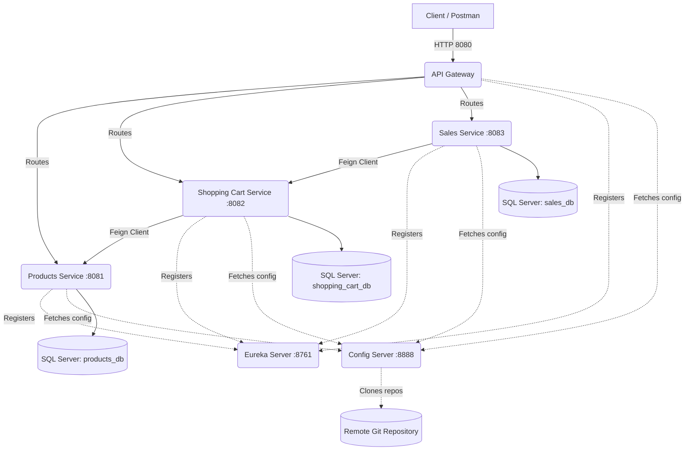

# 🛒 E-Commerce Microservices Architecture


> **About:** Practical learning project implementing a microservices architecture with Java, Spring Boot, and Spring Cloud.

A robust microservices architecture developed with **Spring Boot 4.1.1**, **Spring Cloud 2025.1.2**, and **Java 25**. This project simulates an E-commerce backend applying enterprise design patterns for scalability, service discovery, externalized configuration, and edge routing.

## 🏗 System Architecture

The system applies the microservices pattern with a single entry point (Gateway), dynamic client discovery (Eureka), and centralized configuration via the cloud (Config Server backed by Git).



## 🧩 Components and Microservices

### ⚙️ Infrastructure
1. **`eureka-server` (Port: 8761):** Service Registry. Acts as a phone directory where microservices register to find each other dynamically without hardcoded IPs.
2. **`config-server` (Port: 8888):** Centralized configuration server. Fetches `.yaml` files from an external Git repository to inject them into the microservices, simulating a production environment (Zero-downtime configuration).
3. **`api-gateway` (Port: 8080):** Edge router. The only point exposed to the outside world; it distributes traffic and hides the internal structure of the cluster.

### 💼 Business Logic
1. **`products-service` (Port: 8081):** Management of the product catalog and pricing.
2. **`shopping-cart-service` (Port: 8082):** Shopping cart orchestration. Consumes the `products-service` via **OpenFeign** to calculate total amounts in real time.
3. **`sales-service` (Port: 8083):** Sales processing. Consumes the `shopping-cart-service` to assimilate and process a payment or final transaction.

## 🚀 Prerequisites

* **JDK 25** installed locally (if running without Docker).
* **Docker and Docker Compose** installed.
* **SQL Server** database engine exposed on port `1433`.
* Remote Git repository containing the `config-data/` directory.

## ⚙️ Installation and Setup

1. **Clone the project:**
   ```bash
   git clone <your-repository>
   cd "Practical project with Microservices"
   ```

2. **Set up the environment:**
   * Create an `.env` file based on the template:
   ```bash
   cp .env.example .env
   ```
   * Modify `.env` with your SQL Server credentials and the URL/Credentials of your configuration repository (Git).

3. **Database Initialization (Optional):**
   * Navigate to the `database_scripts/` folder and run the `.sql` scripts inside your database manager (SSMS / DBeaver) after the first startup (to populate data).

## 💻 Running Locally (IDE)

If you prefer to run the microservices locally via your IDE (like IntelliJ IDEA) instead of Docker:
1. Ensure your remote Git Config Repository contains the default local variables (e.g., `${DB_USER:sa}`).
2. In your IDE, configure the **Environment Variables** for the `config-server` run configuration (`GIT_URL`, `GIT_USER`, `GIT_PASSWORD`) so it can fetch the configuration from GitHub.
3. The rest of the microservices will automatically start using the default local variables provided by the `config-server`. Alternatively, you can use the **EnvFile** plugin to inject the `.env` file into each microservice's run configuration.

## 🐳 Running with Docker Compose

The project is orchestrated to be fully brought up with a single command.

```bash
docker compose up -d --build
```
> **Note:** The orchestration uses `depends_on` with `service_healthy` conditions and **healthchecks**. Docker will wait for `config-server` and `eureka-server` to be fully initialized and responsive before starting the business services, preventing any connection failures.
## 📚 API Documentation (OpenAPI / Swagger)

Interactive REST layer documentation is generated using native **Springdoc OpenAPI (v3.1.0)**. You can access the Swagger consoles locally via:

* **Products:** http://localhost:8081/swagger-ui.html
* **Shopping Cart:** http://localhost:8082/swagger-ui.html
* **Sales:** http://localhost:8083/swagger-ui.html

## 🧪 Testing and Postman

In the `postman_collection/` folder you will find the `microservices_collection.json` file. 
* Use it to test the fully automated flow. 
* It uses the **API Gateway** (`http://localhost:8080`) as the central URL and dynamically injects variables (`{{product_id}}`, `{{cart_id}}`) isolating dependencies.